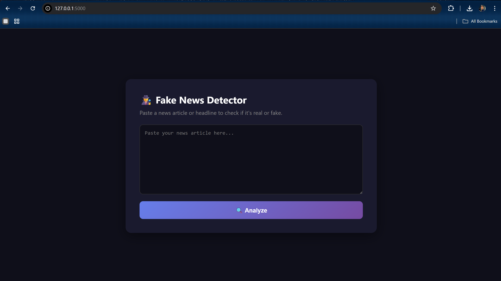

# 🕵️ Fake News Detector

A Machine Learning web app that detects whether a news article is **real or fake** — with a confidence score.

## 🌐 Live Demo
> Deploying soon on Render

## 📸 Screenshot


## 🧠 How It Works
1. User pastes a news article or headline
2. Text is vectorized using **TF-IDF**
3. A **Logistic Regression** model predicts if it's real or fake
4. Result is shown with a **confidence percentage**

## 📊 Model Performance
- Dataset: ISOT Fake News Dataset (44,000+ articles)
- Algorithm: Logistic Regression
- Accuracy: **98.55%**

## 🛠️ Tech Stack
| Layer | Technology |
|---|---|
| Language | Python |
| ML Library | Scikit-learn |
| Web Framework | Flask |
| Text Processing | TF-IDF Vectorizer |
| Frontend | HTML, CSS |

## ⚙️ Run Locally
```bash
# Install dependencies
pip install pandas numpy scikit-learn flask

# Train the model
python train_model.py

# Run the app
python app.py
```
Then open → http://127.0.0.1:5000

## 👨‍💻 Author
**Deep Bhatt** — [GitHub](https://github.com/deep0326)